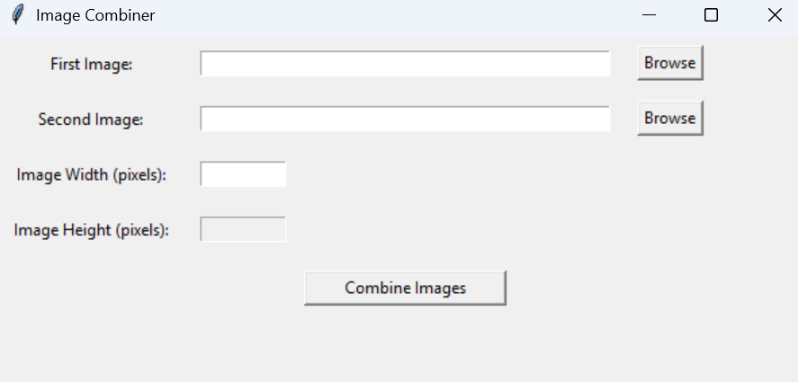

# DoublePageImageCombiner

A Windows GUI tool for combining double-page images from magazines, manga, or photobooks, such as those from Kindle, Shueisha, or other sources. It merges two images side-by-side into a single JPG, ideal for seamless spreads.

## Features
- Drag-and-drop or browse images.
- Auto-detects width and height from the first image.
- Ensures both images have the same height.
- Saves combined images with timestamps (e.g., `combined_image_20250618_013101.jpg`).
- Standalone Windows executable.
- User-friendly with status messages.

## Use Cases
- Manga scans (e.g., Shueisha’s Weekly Shonen Jump).
- Kindle e-book spreads.
- Photobook or magazine pages.

## Screenshot


## Installation

### Option 1: Windows Executable (Recommended)
1. Download `ImageCombiner.exe` from [releases](https://github.com/ShawnNogi/DoublePageImageCombiner/releases/tag/v1.0.0).
2. Double-click to run.

### Usage
- Open ImageCombiner.exe or run python image_combiner_gui.py.

- Add two images (PNG, JPG, JPEG) via drag-and-drop or browse.

- First image sets dimensions (height read-only).

- Second image must match height (e.g., 2799 pixels).
- Click "Combine Images".


### Option 2: Python Script
Requires Python 3.6+ and dependencies.
1. Download [image_combiner_gui.py](image_combiner_gui.py).
2. Install dependencies:
   bash
   ```pip install Pillow tkinterdnd2```
 
Usage
- run the command python image_combiner_gui.py.

- Add two images (PNG, JPG, JPEG) via drag-and-drop or browse.

- First image sets dimensions (height read-only).

- Second image must match height (e.g., 2799 pixels).

- Click "Combine Images".


Example
Input: page1.png, page2.png (1979x2799).

Output: combined_image_20250618_013101.jpg (3958x2799).


## Dependencies
Python 3.6+
Pillow
tkinterdnd2


### Building the Executable
bash

```pip install pyinstaller```
```pyinstaller --onefile --windowed --name ImageCombiner image_combiner_gui.py```

## License
MIT License (see LICENSE).
Contributing
Open issues or pull requests.
Contact
ShawnNogi

